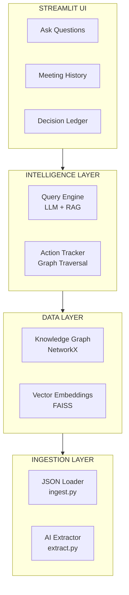
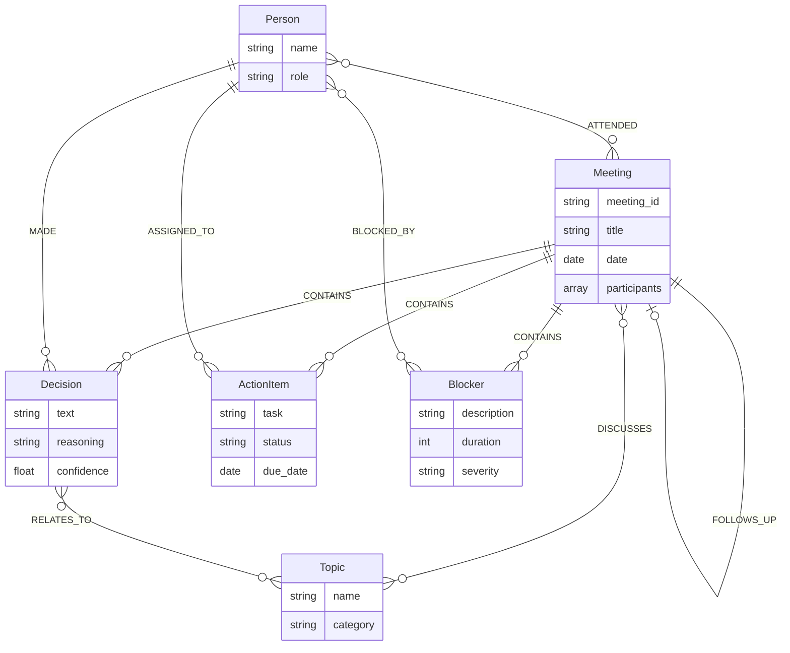
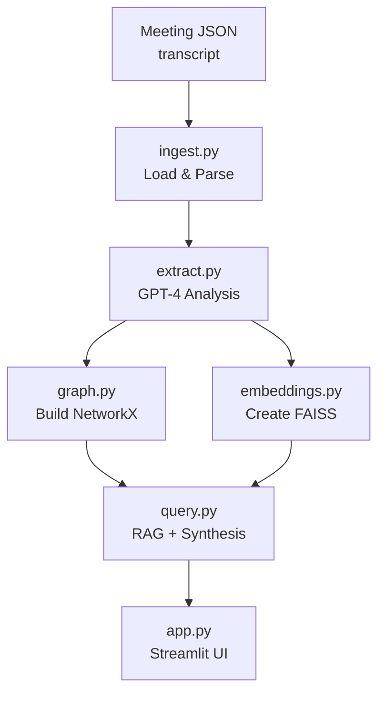

# AMPM - Architecture
### Technical Architecture Overview

---

## High-Level Architecture



---

## Knowledge Graph Schema



### Relationships

| From | Relation | To |
|------|----------|-----|
| Meeting | CONTAINS | Decision |
| Meeting | CONTAINS | Action Item |
| Meeting | CONTAINS | Blocker |
| Meeting | DISCUSSES | Topic |
| Person | ATTENDED | Meeting |
| Person | MADE | Decision |
| Person | ASSIGNED_TO | Action Item |
| Person | BLOCKED_BY | Blocker |
| Decision | RELATES_TO | Topic |
| Meeting | FOLLOWS_UP | Meeting |

---

## Data Flow



---

## Module Responsibilities

### ingest.py
- Load meeting JSON files from data directory
- Parse transcript and metadata
- Return structured meeting objects

### extract.py
- Send transcript to GPT-4 with extraction prompt
- Parse JSON response into structured entities
- Handle edge cases (empty transcripts, missing fields)
- Return: decisions, action_items, blockers, topics

### graph.py
- Create NetworkX DiGraph
- Add nodes for: meetings, decisions, actions, blockers, topics, people
- Add edges for relationships
- Provide query functions:
  - `find_decisions_about(topic)`
  - `track_action_item(person)`
  - `get_meeting_summary(meeting_id)`

### embeddings.py
- Generate embeddings via OpenAI text-embedding-3-small
- Build FAISS index from decision/action texts
- Provide semantic search: `search(query, k=5)`

### query.py
- Combine semantic search results with graph context
- Synthesize answer using GPT-4
- Return answer with sources

### app.py
- Streamlit UI with tabs
- Load data on startup (cached)
- Handle user queries
- Display results with formatting

---

## Tech Stack

### MVP (Hackathon)

| Layer | Technology | Rationale |
|-------|------------|-----------|
| **Transcripts** | Manual JSON | No API setup needed |
| **AI Extraction** | OpenAI GPT-4 | Best extraction quality |
| **Embeddings** | text-embedding-3-small | Fast, cheap, good quality |
| **Knowledge Graph** | NetworkX | In-memory, no DB setup |
| **Vector Store** | FAISS | Embedded, simple |
| **Frontend** | Streamlit | Rapid development |

### Production (Future)

| Layer | Technology | Rationale |
|-------|------------|-----------|
| **Transcription** | Whisper API / Zoom SDK | Automatic capture |
| **AI** | GPT-4 / Claude 3.5 Sonnet | Flexible providers |
| **Graph Database** | Neo4j | Scale, native traversal |
| **Vector Database** | ChromaDB / Pinecone | Persistence, scale |
| **Backend** | FastAPI | Production-ready |
| **Frontend** | React + TypeScript | Rich interactions |

---

## API Design (Future)

### Endpoints

```
POST /meetings/ingest
  Body: { transcript: string, metadata: object }
  Response: { meeting_id: string, entities: object }

GET /query
  Params: ?q=Why did we choose Stripe?
  Response: { answer: string, sources: array }

GET /decisions
  Params: ?topic=payments&since=2026-01-01
  Response: { decisions: array }

GET /actions
  Params: ?person=bob&status=pending
  Response: { actions: array }

GET /meetings/:id
  Response: { meeting: object, entities: object }
```

---

## Performance Targets

| Operation | Target | Actual |
|-----------|--------|--------|
| Meeting extraction | <5s | ~3s |
| Embedding generation | <2s | ~1s |
| Semantic search | <0.5s | ~0.2s |
| Answer synthesis | <3s | ~2s |
| Full query (end-to-end) | <5s | ~3s |

---

## Security Considerations

### Data
- API keys stored in .env (not committed)
- Meeting data stays local (MVP)
- No PII in demo data

### Access (Future)
- User authentication
- Team-based permissions
- Audit logging

### Privacy (Future)
- Opt-out for specific meetings
- Sensitive topic redaction
- Data retention policies

---

## Scalability (Future)

### Horizontal
- Stateless API servers
- Distributed vector store
- Graph database clustering

### Vertical
- Batch embedding generation
- Async extraction pipeline
- Cache frequently asked queries

---

## Error Handling

### Extraction Errors
- Log failed extractions
- Return partial results
- User can retry

### Query Errors
- Graceful fallback messages
- Show available data
- Suggest similar queries

### API Errors
- Retry with backoff
- Rate limit handling
- Clear error messages

---

## Testing Strategy

### Unit Tests
- extract.py: Verify entity extraction
- graph.py: Verify relationship creation
- query.py: Verify answer generation

### Integration Tests
- Full pipeline: JSON -> UI
- Query accuracy
- Response times

### Demo Tests
- Specific demo queries
- Edge cases
- Error scenarios

---

## Deployment (MVP)

```bash
# Local development
pip install -r requirements.txt
export OPENAI_API_KEY="sk-..."
streamlit run app.py

# Demo
# Runs on localhost:8501
# Share screen for presentation
```

---

**AMPM Architecture**

*Simple enough to build in 8 hours. Powerful enough to demo.*
