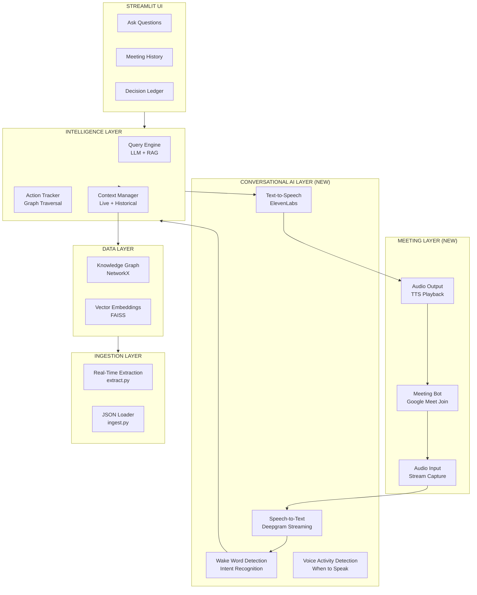
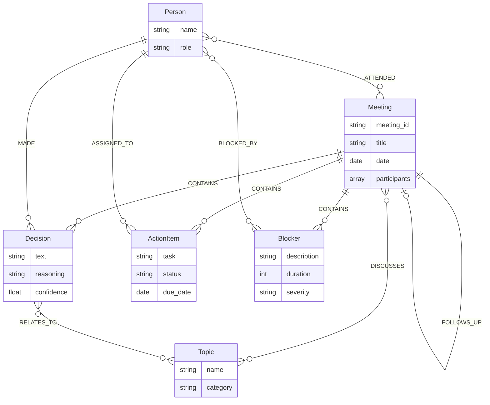
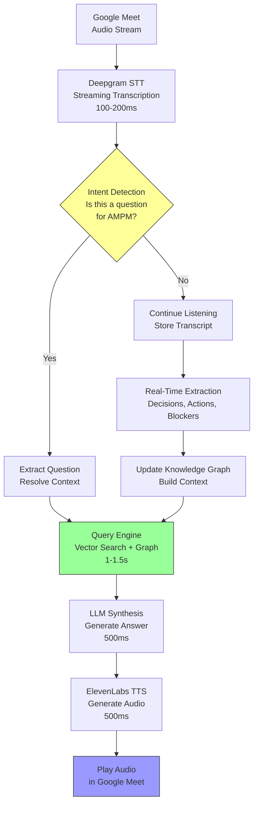
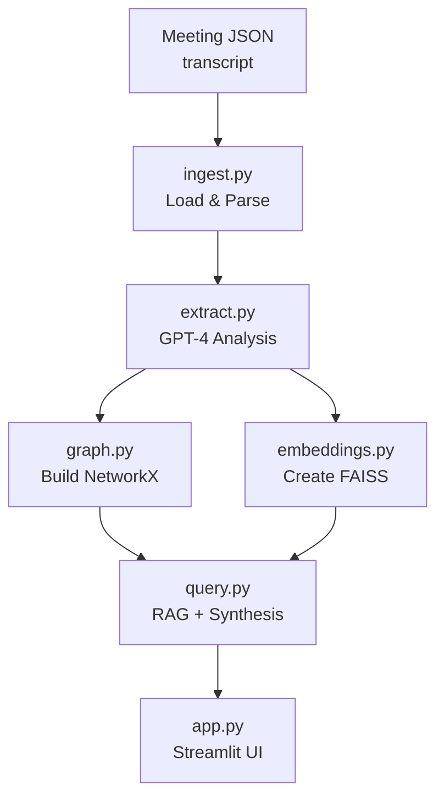

# AMPM - Architecture
### Technical Architecture Overview

---

## Vision: Real-Time Meeting Participation

AMPM is not just a post-meeting analysis tool—it's an **active AI participant** that can:
- Listen to meetings in real-time
- Detect when it's being asked a question
- Query historical knowledge instantly
- **Respond with audio during the meeting**

This transforms AMPM from a passive recorder into an intelligent team member that can answer "Why did we decide that?" **while the meeting is happening**.

---

## High-Level Architecture (Real-Time Vision)



---

## Knowledge Graph Schema



### Relationships

| From | Relation | To |
|------|----------|-----|
| Meeting | CONTAINS | Decision |
| Meeting | CONTAINS | Action Item |
| Meeting | CONTAINS | Blocker |
| Meeting | DISCUSSES | Topic |
| Person | ATTENDED | Meeting |
| Person | MADE | Decision |
| Person | ASSIGNED_TO | Action Item |
| Person | BLOCKED_BY | Blocker |
| Decision | RELATES_TO | Topic |
| Meeting | FOLLOWS_UP | Meeting |

---

## Real-Time Data Flow (NEW - Active Meeting Participation)



**Total Latency Budget:**
- Question detected → 200ms (STT finish)
- Query processing → 1500ms
- TTS generation → 500ms
- **Total: ~2.2 seconds** (meets <3s requirement)

---

## Offline Data Flow (Post-Meeting Analysis)



---

## Module Responsibilities

### ingest.py
- Load meeting JSON files from data directory
- Parse transcript and metadata
- Return structured meeting objects

### extract.py
- Send transcript to GPT-4 with extraction prompt
- Parse JSON response into structured entities
- Handle edge cases (empty transcripts, missing fields)
- Return: decisions, action_items, blockers, topics

### graph.py
- Create NetworkX DiGraph
- Add nodes for: meetings, decisions, actions, blockers, topics, people
- Add edges for relationships
- Provide query functions:
  - `find_decisions_about(topic)`
  - `track_action_item(person)`
  - `get_meeting_summary(meeting_id)`

### embeddings.py
- Generate embeddings via OpenAI text-embedding-3-small
- Build FAISS index from decision/action texts
- Provide semantic search: `search(query, k=5)`

### query.py
- Combine semantic search results with graph context
- Synthesize answer using GPT-4
- Return answer with sources

### app.py
- Streamlit UI with tabs
- Load data on startup (cached)
- Handle user queries
- Display results with formatting

### meeting_bot.py (NEW - Real-Time)
- Join Google Meet using Puppeteer/Playwright
- Capture audio stream from meeting
- Play TTS audio responses back to meeting
- Handle meeting lifecycle (join, mute/unmute, leave)
- Manage audio mixing (prevent echo)

### stt_handler.py (NEW - Real-Time)
- Stream audio to Deepgram for real-time transcription
- Handle speaker diarization (who said what)
- Maintain rolling transcript buffer
- Detect sentence/question completion
- Return: speaker, text, timestamp

### intent_detector.py (NEW - Real-Time)
- Detect wake words ("Hey AMPM", "AMPM,")
- Classify question intent vs normal conversation
- Extract question from context
- Resolve pronouns ("that" = last mentioned topic)
- Return: is_question, query_text, context

### voice_activity.py (NEW - Real-Time)
- Voice Activity Detection (VAD)
- Detect pauses suitable for speaking
- Prevent interrupting mid-sentence
- Determine if AMPM should respond now or wait
- Return: should_speak, confidence

### tts_handler.py (NEW - Real-Time)
- Generate natural speech using ElevenLabs
- Optimize for low latency (~500ms)
- Handle audio format conversion
- Stream audio to meeting bot
- Return: audio_stream

### context_manager.py (NEW - Real-Time)
- Maintain live meeting context window
- Track current topic, recent decisions
- Resolve "it", "that", "the last one" references
- Merge live context with historical knowledge graph
- Provide context-aware query resolution

---

## Tech Stack

### MVP Phase 1 (Hackathon - Offline Mode)

| Layer | Technology | Rationale |
|-------|------------|-----------|
| **Transcripts** | Manual JSON | No API setup needed |
| **AI Extraction** | OpenAI GPT-4 | Best extraction quality |
| **Embeddings** | text-embedding-3-small | Fast, cheap, good quality |
| **Knowledge Graph** | NetworkX | In-memory, no DB setup |
| **Vector Store** | FAISS | Embedded, simple |
| **Frontend** | Streamlit | Rapid development |

### MVP Phase 2 (Real-Time Demo - NEW)

| Layer | Technology | Rationale |
|-------|------------|-----------|
| **Meeting Bot** | Puppeteer/Playwright | Join Google Meet as participant |
| **Audio Capture** | WebRTC / Browser API | Capture meeting audio stream |
| **Speech-to-Text** | Deepgram Streaming | 100-200ms latency, speaker ID |
| **Intent Detection** | GPT-4 Mini | Fast, cheap classification |
| **Voice Activity Detection** | Silero VAD | Detect pauses to speak |
| **Text-to-Speech** | ElevenLabs | Natural voice, ~500ms latency |
| **Audio Playback** | Virtual Audio Device | Play responses in meeting |
| **Orchestration** | Python asyncio | Coordinate real-time pipeline |

### Production (Future)

| Layer | Technology | Rationale |
|-------|------------|-----------|
| **Meeting Integration** | Google Meet API, Zoom SDK | Official integrations |
| **Transcription** | Deepgram / AssemblyAI | Real-time streaming STT |
| **AI** | GPT-4 / Claude 3.5 Sonnet | Flexible providers |
| **Graph Database** | Neo4j | Scale, native traversal |
| **Vector Database** | ChromaDB / Pinecone | Persistence, scale |
| **Backend** | FastAPI + WebSockets | Real-time + REST API |
| **Frontend** | React + TypeScript | Rich interactions |
| **Audio Pipeline** | Twilio / Daily.co | Enterprise-grade audio |

---

## API Design (Future)

### Endpoints

```
POST /meetings/ingest
  Body: { transcript: string, metadata: object }
  Response: { meeting_id: string, entities: object }

GET /query
  Params: ?q=Why did we choose Stripe?
  Response: { answer: string, sources: array }

GET /decisions
  Params: ?topic=payments&since=2026-01-01
  Response: { decisions: array }

GET /actions
  Params: ?person=bob&status=pending
  Response: { actions: array }

GET /meetings/:id
  Response: { meeting: object, entities: object }
```

### Real-Time WebSocket API (NEW)

```
WS /meeting/join
  Events:
    -> connect: { meeting_id: string, bot_name: string }
    <- audio_stream: binary audio data
    -> transcript: { speaker: string, text: string, timestamp: number }
    <- question_detected: { question: string, confidence: float }
    -> answer: { text: string, sources: array }
    <- audio_response: binary TTS audio
    -> meeting_end

WS /meeting/status
  Events:
    <- participant_joined/left
    <- decision_detected
    <- action_item_created
    <- blocker_mentioned
```

---

## Performance Targets

### Offline Mode
| Operation | Target | Actual |
|-----------|--------|--------|
| Meeting extraction | <5s | ~3s |
| Embedding generation | <2s | ~1s |
| Semantic search | <0.5s | ~0.2s |
| Answer synthesis | <3s | ~2s |
| Full query (end-to-end) | <5s | ~3s |

### Real-Time Mode (NEW - CRITICAL)
| Operation | Target | Why It Matters |
|-----------|--------|----------------|
| STT latency (streaming) | <200ms | Natural conversation flow |
| Intent classification | <100ms | Don't miss the question |
| Query execution | <1500ms | Meets <3s total budget |
| Answer synthesis | <500ms | Quick, focused responses |
| TTS generation | <500ms | Voice output delay |
| **Total response time** | **<3s** | **Feels conversational, not robotic** |
| Context resolution | <50ms | "That" = last topic mentioned |
| VAD decision | <100ms | Know when to speak |

**Why <3 seconds matters:**
- At 2-3s: Feels like talking to a teammate
- At 5s: Awkward pause, people move on
- At 10s+: Meeting has moved to next topic

---

## Security Considerations

### Data
- API keys stored in .env (not committed)
- Meeting data stays local (MVP)
- No PII in demo data

### Access (Future)
- User authentication
- Team-based permissions
- Audit logging

### Privacy (Future)
- Opt-out for specific meetings
- Sensitive topic redaction
- Data retention policies

---

## Scalability (Future)

### Horizontal
- Stateless API servers
- Distributed vector store
- Graph database clustering

### Vertical
- Batch embedding generation
- Async extraction pipeline
- Cache frequently asked queries

---

## Error Handling

### Extraction Errors
- Log failed extractions
- Return partial results
- User can retry

### Query Errors
- Graceful fallback messages
- Show available data
- Suggest similar queries

### API Errors
- Retry with backoff
- Rate limit handling
- Clear error messages

---

## Testing Strategy

### Unit Tests
- extract.py: Verify entity extraction
- graph.py: Verify relationship creation
- query.py: Verify answer generation

### Integration Tests
- Full pipeline: JSON -> UI
- Query accuracy
- Response times

### Demo Tests
- Specific demo queries
- Edge cases
- Error scenarios

---

## Real-Time Implementation Challenges (NEW)

### 1. When to Speak (Conversational Intelligence)

**Challenge:** Knowing when AMPM should respond vs stay silent

**Solutions:**
- Wake word detection ("Hey AMPM")
- Question pattern recognition ("Why did we...", "What happened with...")
- Confidence scoring (only respond if >80% confident)
- Context awareness (is this a rhetorical question?)

**Example:**
```
Sarah: "Why did we choose Stripe again?"  → AMPM responds ✓
Sarah: "Why is it always like this?"      → AMPM stays silent ✓
Bob: "Hey AMPM, what's blocking me?"      → AMPM responds ✓
```

### 2. Audio Echo Prevention

**Challenge:** AMPM hearing its own voice through the meeting audio

**Solutions:**
- Echo cancellation in audio pipeline
- Mute input during TTS playback
- Audio fingerprinting to detect self-speech
- Separate audio channels (input vs output)

### 3. Context Resolution ("That", "It", "The Decision")

**Challenge:** Understanding pronouns in questions

**Solutions:**
- Maintain rolling context window (last 2 minutes)
- Track recent mentions of decisions, actions, people
- Use coreference resolution (GPT-4 for complex cases)

**Example:**
```
Mike: "We chose Stripe for better fraud detection"
[2 minutes later]
Sarah: "Hey AMPM, why did we make that choice?"
→ AMPM resolves "that choice" = "Stripe decision"
```

### 4. Interruption Etiquette

**Challenge:** Don't talk over people, but respond quickly

**Solutions:**
- Voice Activity Detection (VAD) - detect natural pauses
- Wait for 1-2 second silence after question
- If interrupted, stop speaking immediately
- Queue response if conversation is too fast

### 5. Multiple Speakers / Cross-Talk

**Challenge:** Handling overlapping speech and multiple questions

**Solutions:**
- Speaker diarization (know who asked)
- Queue questions if multiple people ask at once
- Address by name ("Sarah, the answer is...")
- Handle corrections mid-response

### 6. Accuracy vs Speed Tradeoff

**Challenge:** Fast answers might be wrong; accurate answers might be slow

**Solutions:**
- Confidence thresholds - if <70%, say "I'm not sure, but..."
- Two-tier responses:
  - Fast: "Based on May 1st planning, we chose Stripe"
  - Slow: Full synthesis with all context
- User feedback loop - learn when to dig deeper

---

## Real-Time Implementation Phases

### Phase 1: Offline Mode (Hackathon Day 1)
✓ Manual JSON ingestion
✓ Knowledge graph building
✓ Query engine with <3s response
✓ Streamlit UI demo

### Phase 2: Real-Time Listening (Post-Hackathon Week 1)
- Meeting bot joins Google Meet
- Real-time STT streaming
- Live transcript display
- Auto-extraction during meeting
- Decision/Action detection in real-time

### Phase 3: Wake Word Response (Week 2)
- "Hey AMPM" detection
- Intent classification
- Simple Q&A responses (text output first)
- Test latency budget (<3s)

### Phase 4: Audio Responses (Week 3)
- TTS integration
- Audio playback in meeting
- VAD and interruption handling
- Full conversational loop

### Phase 5: Context Intelligence (Week 4)
- Pronoun resolution
- Multi-turn conversations
- Proactive insights ("That's similar to the decision you made in April")
- Meeting health monitoring

---

## Alternative Implementation Approaches

### Approach 1: Full Custom Build (Most Control)
**Pros:** Complete control, custom optimizations
**Cons:** High complexity, 4-6 weeks development
**Stack:** Puppeteer + Deepgram + Custom orchestration

### Approach 2: Use Meeting Platform APIs (Most Reliable)
**Pros:** Official support, better audio quality
**Cons:** Requires enterprise accounts, API approval
**Stack:** Recall.ai + Deepgram + Your intelligence layer

### Approach 3: Browser Extension (Easiest User Adoption)
**Pros:** No bot in meeting, direct browser access
**Cons:** Limited to browser-based meetings
**Stack:** Chrome Extension + Background service

### Approach 4: Hybrid (Recommended for MVP)
**Pros:** Use existing tools for hard parts, focus on intelligence
**Cons:** Dependency on third-party services
**Stack:**
- **Audio:** Recall.ai or Symbl.ai (handles meeting join + STT)
- **Intelligence:** Your custom query engine
- **Output:** Webhook → TTS → Recall.ai audio injection

---

## Deployment (MVP)

### Offline Mode
```bash
# Local development
pip install -r requirements.txt
export OPENAI_API_KEY="sk-..."
streamlit run app.py

# Demo
# Runs on localhost:8501
# Share screen for presentation
```

### Real-Time Mode (Future)
```bash
# Install additional dependencies
pip install deepgram-sdk elevenlabs playwright

# Set up environment
export DEEPGRAM_API_KEY="..."
export ELEVENLABS_API_KEY="..."
export GOOGLE_MEET_URL="..."

# Run real-time bot
python meeting_bot.py --mode realtime --meeting-url $GOOGLE_MEET_URL

# Monitor logs
tail -f logs/meeting_bot.log
```

---

## Success Metrics

### Offline Mode (Hackathon)
- ✓ Extract decisions/actions from 4 sample meetings
- ✓ Answer "Why did we decide X?" in <3s
- ✓ Track action item across 5 meetings
- ✓ Demo runs smoothly for judges

### Real-Time Mode (Post-Hackathon)
- Join meeting successfully (99% success rate)
- STT accuracy >90%
- Question detection precision >85%
- Response time <3s (95th percentile)
- Natural-sounding TTS (user testing)
- Zero interruptions during active speech
- Users rate as "helpful, not annoying"

---

**AMPM Architecture**

*Phase 1: Simple enough to build in 8 hours. Powerful enough to demo.*
*Phase 2: Real-time participation that feels like talking to a teammate.*
