# AMPM - Task Breakdown
### Clear Tasks for Team Assignment

---

## Team Roles

| Person | Role | Focus Area |
|--------|------|------------|
| **Person A** | Backend Lead | Data ingestion, AI extraction, knowledge graph |
| **Person B** | Intelligence Lead | Semantic search, query engine, connections |
| **Person C** | Frontend Lead | Streamlit UI, demo polish |

*Assign names during kickoff*

---

## Judging Criteria Alignment

| Criteria | What It Means | How We Win |
|----------|--------------|------------|
| **Completeness** | Working MVP, not just slides | Full pipeline: ingest -> extract -> query -> UI |
| **Tastefulness** | Clean, elegant, thoughtful | Minimal UI, clear typography, smooth UX |
| **Novelty** | Unique approach | Decision memory + cross-meeting connections |

---

## MVP Definition (What "Complete" Looks Like)

**Must Have (Core):**
- Ingest 3-5 meeting transcripts from JSON
- Extract decisions, action items, blockers with AI
- Build knowledge graph with connections
- Context query: "Why did we decide X?" -> Answer in <3s
- Action item tracking across meetings
- Clean UI showing both features
- Real data flowing through (not mocked responses)

**Should Have (Polish):**
- Source citations in answers
- Meeting timeline view
- Decision ledger view
- Loading states and timing display

**Nice to Have (If Time):**
- Graph visualization
- Meeting health dashboard
- Export decision report

---

## Task Breakdown by Phase

### Phase 0: Setup (Before Hackathon)
**Owner: Everyone**

| Task | Owner | Status |
|------|-------|--------|
| Create sample meeting files (4 meetings with connected story) | All | Pending |
| Set up GitHub repo | Person A | Pending |
| Get OpenAI API key | Person A | Pending |
| Install dependencies locally | All | Pending |
| Test OpenAI connection | Person A | Pending |
| Review architecture together | All | Pending |

---

### Phase 1: Data Layer + Extraction (Hours 0-3)
**Owner: Person A (Backend Lead)**

| Task ID | Task | Dependencies | Est. Time |
|---------|------|--------------|-----------|
| A1 | Create project structure (folders, files) | None | 15 min |
| A2 | Create sample meeting JSON files | None | 45 min |
| A3 | Build `ingest.py` - load meetings from JSON | A2 | 20 min |
| A4 | Build `extract.py` - AI extraction with GPT-4 | A3 | 45 min |
| A5 | Test extraction on all sample meetings | A4 | 20 min |
| A6 | Build `graph.py` - NetworkX graph creation | A4 | 45 min |
| A7 | Implement cross-meeting connections | A6 | 30 min |
| A8 | Test full data pipeline | A3-A7 | 15 min |

**Deliverable:** All meetings extracted, graph built with connections

---

### Phase 2: Query + Intelligence (Hours 3-5)
**Owner: Person B (Intelligence Lead)**

| Task ID | Task | Dependencies | Est. Time |
|---------|------|--------------|-----------|
| B1 | Build `embeddings.py` - create embeddings with OpenAI | A6 | 30 min |
| B2 | Build FAISS index from graph nodes | B1 | 20 min |
| B3 | Implement semantic search function | B2 | 20 min |
| B4 | Build `query.py` - context retrieval engine | B3 | 45 min |
| B5 | Implement answer synthesis with LLM | B4 | 30 min |
| B6 | Test "Why did we decide X?" queries | B5 | 15 min |
| B7 | Implement action item timeline tracking | A6 | 30 min |
| B8 | Test action item queries | B7 | 15 min |

**Deliverable:** Both decision queries and action tracking working

---

### Phase 3: UI Layer (Hours 5-7)
**Owner: Person C (Frontend Lead)**

| Task ID | Task | Dependencies | Est. Time |
|---------|------|--------------|-----------|
| C1 | Set up Streamlit app structure | None | 15 min |
| C2 | Design UI layout (tabs, sidebar) | None | 20 min |
| C3 | Build "Ask Questions" tab | B6 | 45 min |
| C4 | Style answer display (sources, citations) | C3 | 30 min |
| C5 | Build "Meeting History" tab | A8 | 45 min |
| C6 | Build "Decision Ledger" tab | A8 | 30 min |
| C7 | Add sidebar stats (meetings, decisions, actions) | A8 | 15 min |
| C8 | Add loading states and timing display | C3-C6 | 20 min |
| C9 | Polish overall look (spacing, typography) | C8 | 30 min |
| C10 | Test full user flow | C9 | 20 min |

**Deliverable:** Full Streamlit app working with real data

---

### Phase 4: Integration & Demo (Hours 7-8)
**Owner: Everyone**

| Task ID | Task | Dependencies | Est. Time |
|---------|------|--------------|-----------|
| D1 | Integration testing - full pipeline | C10 | 20 min |
| D2 | Fix any bugs found | D1 | 30 min |
| D3 | Prepare demo scenario | D2 | 15 min |
| D4 | Practice demo (all team members) | D3 | 20 min |
| D5 | Take screenshots as backup | D4 | 10 min |
| D6 | Final pitch rehearsal | D4 | 15 min |

**Deliverable:** Demo-ready MVP

---

## Parallel Work Streams

```mermaid
gantt
    title Hackathon Timeline
    dateFormat HH
    axisFormat %H:00

    section Person A
    Data + Extraction     :a1, 00, 3h
    Support               :a2, after a1, 4h
    Demo                  :a3, 07, 1h

    section Person B
    Wait                  :b0, 00, 3h
    Query + Intelligence  :b1, 03, 2h
    Support               :b2, after b1, 2h
    Demo                  :b3, 07, 1h

    section Person C
    Design                :c0, 00, 1h
    Wait                  :c1, 01, 4h
    UI Layer              :c2, 05, 2h
    Demo                  :c3, 07, 1h
```



**Key Sync Points:**
- Hour 3: Data + Extraction done -> Person B can start
- Hour 5: Query + Intelligence done -> Person C can integrate
- Hour 7: All integrate for final testing

---

## File Structure

```
ampm/
|-- data/
|   +-- meetings/
|       |-- planning_may1.json        # Planning meeting (decisions made)
|       |-- standup_may2.json         # Status check
|       |-- standup_may4.json         # Blocker identified
|       +-- leadership_may8.json      # Resolution
|-- src/
|   |-- __init__.py
|   |-- ingest.py                     # Person A: Load transcripts
|   |-- extract.py                    # Person A: AI extraction
|   |-- graph.py                      # Person A: Knowledge graph
|   |-- embeddings.py                 # Person B: Vector search
|   +-- query.py                      # Person B: Query engine
|-- app.py                            # Person C: Streamlit UI
|-- requirements.txt
|-- .env                              # OPENAI_API_KEY
+-- README.md
```

---

## Definition of Done (Per Task)

**Code Tasks:**
- [ ] Code written and working
- [ ] Tested with sample data
- [ ] No hardcoded values (use config/env)
- [ ] Commented if complex

**UI Tasks:**
- [ ] Looks clean and professional
- [ ] Works with real data (not mocked)
- [ ] Loading states shown
- [ ] Errors handled gracefully

**Integration Tasks:**
- [ ] End-to-end flow works
- [ ] Response times measured (<3s)
- [ ] Demo scenario rehearsed

---

## Risk Mitigation

| Risk | Mitigation |
|------|------------|
| OpenAI API rate limits | Cache extractions, batch embeddings |
| Slow extraction | Use GPT-4-turbo, shorter prompts |
| Integration issues | Sync at Hour 2, 4, 7 |
| Demo fails | Have screenshots ready |
| Time runs out | Prioritize core features, cut polish |

---

## Communication

**During Hackathon:**
- Quick sync every 2 hours
- Slack/Discord for async questions
- Scream if blocked (don't wait)

**Blockers Protocol:**
1. Try for 10 minutes
2. Ask teammate
3. Use AI assistant
4. Pivot if still stuck

---

## Success Criteria

**Completeness (40%):**
- [ ] Full pipeline works: data -> extract -> query -> UI
- [ ] Real responses (not mocked)
- [ ] Both features functional (decisions + action items)

**Tastefulness (30%):**
- [ ] Clean, minimal UI
- [ ] Good typography and spacing
- [ ] Smooth user experience
- [ ] No visual clutter

**Novelty (30%):**
- [ ] Decision memory concept is unique
- [ ] Cross-meeting connections are novel
- [ ] "AI PM" positioning is differentiated

---

## Pre-Hackathon Checklist

**Everyone:**
- [ ] Read this entire document
- [ ] Understand your tasks
- [ ] Set up local development environment
- [ ] Test that dependencies install
- [ ] Know who to ask if stuck

**Person A:**
- [ ] Sample meeting files ready
- [ ] OpenAI API key obtained and tested
- [ ] NetworkX basics understood
- [ ] Extraction prompt drafted

**Person B:**
- [ ] Understand semantic search approach
- [ ] FAISS basics understood
- [ ] Query synthesis prompt drafted

**Person C:**
- [ ] Streamlit basics understood
- [ ] UI mockup in mind
- [ ] Color scheme decided

---

## Demo Queries to Prepare

**Must work:**
1. "Why did we choose Stripe for payments?"
2. "What's blocking Bob?"
3. "Tell me about the Legal approval"

**Nice to have:**
4. "What decisions did we make this week?"
5. "Who is assigned to the Stripe integration?"

---

**Let's build this.**

*From AM to PM, never miss a decision.*
